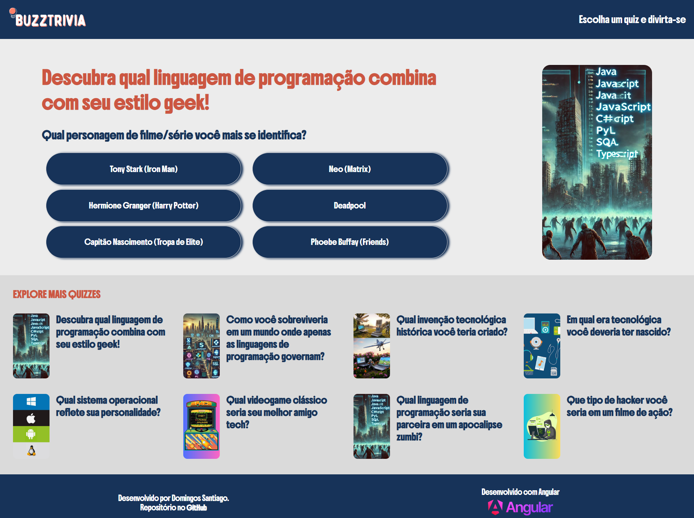

# BuzzTrivia


**Repositório no GitHub**: [https://github.com/dominuuus/BuzzTrivia](https://github.com/dominuuus/BuzzTrivia)  
🔗 **Aplicação Hospedada**: [https://buzz-trivia.vercel.app/](https://buzz-trivia.vercel.app/)

## 📌 Descrição

O **BuzzTrivia** é uma página web interativa onde os usuários podem explorar **10 quizzes divertidos** que combinam **tecnologia e cultura geek**. O projeto foi desenvolvido utilizando **Angular** e **TypeScript** como parte do bootcamp **Decolar Tech 2025 Avanade** promovido pela **DIO**. 

O desafio consistia em criar uma **réplica da página de quizzes do BuzzFeed**, permitindo uma experiência dinâmica e envolvente.

## 📜 Exemplos de Quizzes

O projeto conta com quizzes divertidos como:

- **"Descubra qual linguagem de programação combina com seu estilo geek!"**
- **"Qual invenção tecnológica histórica você teria criado?"**
- **"Qual sistema operacional reflete sua personalidade?"**
- **"Qual linguagem de programação seria sua parceira em um apocalipse zumbi?"**


🔹 **Tecnologias usadas no projeto** incluem:  
- **Angular CLI v19.2.3**: Framework principal para construção da aplicação;
- **TypeScript**: Para tipagem e lógica robusta;
- **HTML e CSS**: Para estruturação e estilização;
- **JSON**: Para armazenamento e organização dos dados dos quizzes;
- **Vercel**: Plataforma de hospedagem da aplicação.

## 🌟 Funcionalidades

- 🚀 **Quizzes interativos sobre tecnologia e cultura geek**
- 🎨 **Design personalizado** com identidade visual única
- 🔀 **Sistema de navegação estruturado com rotas**
- 🔍 **Perguntas geradas com IA** para proporcionar uma experiência envolvente
- 📂 **Armazenamento de quizzes em JSON** para facilitar a manutenção dos dados

## 📌 Desafios e Aprendizados

- Para estilização, utilizei meu conhecimento em CSS e HTML e criei a identidade visual 100% de forma autônoma, buscando apenas inspiração de paleta de cores em sites como adobe color;

- Para a estruturação dos componentes, segui a vídeo aula com o Felipe Aguiar que mostrou a criação de um quiz, então decidi por explorar outros recursos como a criação de mais quiz e explorar um pouco sobre rotas;

- Ao optar por ir além e criar mais quizzes e também realizar a estruturação da página para que funcione com rotas, precisei rever vídeos do módulo e assistir vídeos no Youtube de conteúdos relacionado ao Angular, principalmente na dificuldade que tive com o erro "Please define 'getPrerenderParams' function for this route in your server routing configuration or specify a different 'renderMode'." Para realizar a correção, precisei fazer várias pesquisas até entender que poderia realizar um ajuste no arquivo JSON. Aqui a ajuda da IA Generativa foi essencial para direcionar as correções necessárias para a correção.

### Processo Criativo
- **Conteúdo dos Quizzes**: Utilizei IA generativa para criar a estrutura inicial das perguntas e relacionar os temas com linguagens de programação e resultados personalizados;
- **Estilização**: Criei a identidade visual de forma 100% autônoma, utilizando conhecimentos em **CSS** e **HTML**, com inspiração em paletas de cores de sites como Adobe Color;
- **Estrutura**: Segui a vídeo aula do instrutor Felipe Aguiar como base para o primeiro quiz e expandi o projeto com mais quizzes e rotas, revisando módulos do bootcamp e buscando tutoriais no YouTube;
- **Desafios Técnicos**: Enfrentei o erro *"Please define 'getPrerenderParams' function for this route..."* e, com pesquisas e auxílio de IA, ajustei o arquivo JSON para corrigir o problema e garantir o funcionamento das rotas;
- **Imagens**: Algumas imagens foram retiradas gratuitamente do site https://br.freepik.com e outras foram geradas através de IA Generativa;
- **Responsividade**: O projeto está adaptado para a visualização em smartphone e tablet.




## 🚀 Como Executar o Projeto Localmente

1. Clone o repositório:
   ```bash
   git clone https://github.com/dominuuus/BuzzTrivia.git

2. Navegue até o diretório do projeto:
   ```bash
   cd BuzzTrivia

3. Instale as dependências:
   ```bash
   npm install

4. Inicie a aplicação:
   ```bash
   ng serve


